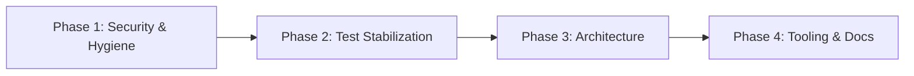

# REFACTOR PLAN — Road to 90/90

**Created:** 2026-03-04
**Baseline Score:** 48/90 (53%) — see `codebase_audit.md`
**Target Score:** 90/90 (100%)

---

## Phase 1: Critical Security & Repo Hygiene

**Goal:** Eliminate tracked secrets, stale assets, and committed build artifacts.
**Audit Dimensions Impacted:** Repo Hygiene (4→9), Build & Dev Environment (6→8)

### Step 1.1 — Remove `release.keystore` from Git History

| Detail | Value |
|--------|-------|
| **File** | `android/app/release.keystore` |
| **Status** | Already in `.gitignore` but **still tracked** (`git ls-files` returns it) |
| **Action** | `git rm --cached android/app/release.keystore` then commit |
| **Verification** | `git ls-files android/app/release.keystore` returns empty |

> [!CAUTION]
> Consider running `git filter-repo` or `BFG Repo Cleaner` to purge the keystore from full history. At minimum, remove from HEAD.

### Step 1.2 — Remove Tracked `dist/` Build Artifacts

| Detail | Value |
|--------|-------|
| **Files** | `dist/c733a880bd6d3d1f0f38.png`, `dist/fae3c934a7353e1defbb.png`, `dist/index.html` |
| **Action** | `git rm --cached -r dist/` |
| **Verification** | `git ls-files dist/` returns empty. `.gitignore` already has `dist/` on line 18 |

### Step 1.3 — Delete Stale P5/Comic Screenshots

| Detail | Value |
|--------|-------|
| **Files** | `assets/screenshots/comic-ui-home.png`, `assets/screenshots/p5-ui-current-state.png`, `assets/screenshots/p5-ui-screenshot.png`, `assets/screenshots/p5-ui-screenshot2.png`, `assets/screenshots/p5-ui-screenshot3.png` |
| **Action** | `git rm` each file (full delete, not just untrack) |
| **Verification** | `git ls-files assets/screenshots/ | Select-String 'p5|comic'` returns empty |

### Step 1.4 — Remove `scorecard.png` from Repo Root

| Detail | Value |
|--------|-------|
| **File** | `scorecard.png` |
| **Action** | `git rm scorecard.png` |
| **Verification** | File no longer in `git ls-files` |

### Step 1.5 — Fix `index.html` Polyfill Conflict

| Detail | Value |
|--------|-------|
| **File** | `public/index.html` (lines 53–59) |
| **Problem** | Hardcodes `window.process.env.NODE_ENV = "development"` which can conflict with webpack `DefinePlugin` in production builds |
| **Action** | Remove the `NODE_ENV` assignment from the polyfill. Keep only `window.process = window.process || {}; window.process.env = window.process.env || {};` |
| **Verification** | `npm run build:web` succeeds. Grep `index.html` for `NODE_ENV` returns no matches |

### Step 1.6 — Self-Host Icon Font

| Detail | Value |
|--------|-------|
| **File** | `public/index.html` (line 20) |
| **Problem** | CDN dependency on `cdn.jsdelivr.net` for `MaterialCommunityIcons.ttf` |
| **Action** | Copy `node_modules/react-native-vector-icons/Fonts/MaterialCommunityIcons.ttf` to `public/fonts/`. Update `@font-face src` URL to `url("./fonts/MaterialCommunityIcons.ttf")` |
| **Verification** | Kill network access to `cdn.jsdelivr.net` and verify icons render on web |

### Step 1.7 — Create `.env.example`

| Detail | Value |
|--------|-------|
| **File** | `.env.example` (NEW) |
| **Action** | Document all `EXPO_PUBLIC_*` vars used in `webpack.config.js` and any API keys referenced in services |
| **Verification** | File exists at repo root with commented descriptions |

### Phase 1 Commit Message

```
security: remove tracked secrets + stale assets, fix polyfill conflict

- Remove release.keystore from git tracking
- Remove committed dist/ build artifacts
- Delete stale P5/comic screenshots
- Remove scorecard.png from root
- Fix NODE_ENV polyfill conflict in index.html
- Self-host MaterialCommunityIcons font
- Add .env.example
```

### Phase 1 Verification Criteria

- [ ] `git ls-files android/app/release.keystore` → empty
- [ ] `git ls-files dist/` → empty
- [ ] `git ls-files scorecard.png` → empty
- [ ] `git ls-files assets/screenshots/ | Select-String 'p5|comic'` → empty
- [ ] `npm run build:web` succeeds
- [ ] `.env.example` exists

---

## Phase 2: Test Stabilization

**Goal:** Fix all 5 failing test suites (12 failing tests) and add coverage thresholds.
**Audit Dimensions Impacted:** Test Suite (7→10), Test Coverage (6→8)

### Step 2.1 — Fix `useGoogleSyncPolling.test.tsx`

| Detail | Value |
|--------|-------|
| **File** | `__tests__/useGoogleSyncPolling.test.tsx` |
| **Root Cause** | Mock for `GoogleTasksSyncService.startForegroundPolling` is stale after the service was refactored to use `GoogleTasksApiClient` |
| **Action** | Update mock to match current `GoogleTasksSyncService` export shape. Ensure `startForegroundPolling` and `stopForegroundPolling` mock signatures align |
| **Verification** | `npx jest useGoogleSyncPolling --verbose` → all green |

### Step 2.2 — Fix `PlaudService.test.ts`

| Detail | Value |
|--------|-------|
| **File** | `__tests__/PlaudService.test.ts` |
| **Root Cause** | `transcribe()` returns `{ success: false }` because the web-platform mock setup doesn't properly simulate the `fetch` response |
| **Action** | Update the mock `fetch` to return a valid response object with `ok: true` and a JSON body. Verify `Platform.OS` mock is set to `'web'` for web tests |
| **Verification** | `npx jest PlaudService --verbose` → all green |

### Step 2.3 — Fix `CalendarScreen.test.tsx`

| Detail | Value |
|--------|-------|
| **File** | `__tests__/CalendarScreen.test.tsx` |
| **Root Cause** | Likely rendering with stale theme/platform mocks after `ThemeProvider` removal and `PlatformUtils` migration |
| **Action** | Update component mocks to use `useTheme` from `src/theme/useTheme` instead of deprecated `ThemeProvider`. Verify `isWeb`/`isAndroid` mocks |
| **Verification** | `npx jest CalendarScreen --verbose` → all green |

### Step 2.4 — Fix `DiagnosticsScreen.test.tsx`

| Detail | Value |
|--------|-------|
| **File** | `__tests__/DiagnosticsScreen.test.tsx` |
| **Root Cause** | Screen references `Platform.OS` directly for display value (line 267) — may conflict with mocked platform |
| **Action** | Align test mocks with current component structure. Ensure `PlatformUtils` import is properly mocked |
| **Verification** | `npx jest DiagnosticsScreen --verbose` → all green |

### Step 2.5 — Fix `HomeScreen.test.tsx`

| Detail | Value |
|--------|-------|
| **File** | `__tests__/HomeScreen.test.tsx` |
| **Root Cause** | `HomeScreen` was refactored (entrance animation extracted to `useEntranceAnimation`, theme provider removed). Test mocks are stale |
| **Action** | Update mocks for `useEntranceAnimation`, `useTheme`, and verify `ModeCard` import path |
| **Verification** | `npx jest HomeScreen --verbose` → all green |

### Step 2.6 — Add `--detectOpenHandles` to Jest Config

| Detail | Value |
|--------|-------|
| **File** | `jest.config.js` or `package.json` jest section |
| **Action** | Add `detectOpenHandles: true` and `forceExit: true` to jest config |
| **Verification** | Tests exit cleanly without async leaks warning |

### Step 2.7 — Add Coverage Threshold

| Detail | Value |
|--------|-------|
| **File** | `jest.config.js` or `package.json` jest section |
| **Action** | Add `coverageThreshold: { global: { lines: 60, branches: 50, functions: 55, statements: 60 } }` as a starting floor, ratcheting up as coverage improves |
| **Verification** | `npx jest --coverage` passes and prints threshold report |

### Phase 2 Commit Message

```
test: fix 5 failing suites, add coverage thresholds and open-handle detection

- Fix stale mocks in useGoogleSyncPolling, PlaudService, CalendarScreen,
  DiagnosticsScreen, HomeScreen tests
- Add detectOpenHandles + forceExit to jest config
- Add coverageThreshold (lines: 60%, branches: 50%)
```

### Phase 2 Verification Criteria

- [ ] `npx jest --passWithNoTests` → **0 failures**, 258/258 pass
- [ ] `npx jest --coverage` → threshold passes
- [ ] No "open handles" warnings in test output

---

## Phase 3: Architecture & Platform Abstraction

**Goal:** Break down oversized screens, centralize platform checks, and unify theme types.
**Audit Dimensions Impacted:** Architecture/SRP (5→8), Platform Abstraction (5→9)

### Step 3.1 — Complete `Platform.OS` → `PlatformUtils` Migration

| Detail | Value |
|--------|-------|
| **Files (27 remaining occurrences)** | `BrainDumpScreen.tsx` (7), `useBrainDumpItems.ts` (4), `HomeScreen.tsx` (3), `DiagnosticsScreen.tsx` (2), `OAuthService.ts` (2), `RuneButton.tsx` (1), `WebMCPService.ts` (1), `bootstrap.ts` (1), `useBrainDumpRecording.ts` (1), `CaptureDrawer.tsx` (1), `CaptureBubble.tsx` (1), `BrainDumpScreen.tsx` duplicate import (1) |
| **Action** | Replace each `Platform.OS !== 'web'` → `!isWeb`, `Platform.OS !== 'android'` → `!isAndroid`, `Platform.OS === 'web'` → `isWeb`. Remove unused `Platform` imports. `DiagnosticsScreen` line 267 (`value: Platform.OS`) is a display value — leave as-is or use a helper |
| **Verification** | `grep -r "Platform.OS" src/ --include="*.ts" --include="*.tsx"` returns only `PlatformUtils.ts` (3 canonical definitions) + `DiagnosticsScreen.tsx` (1 display value) + `cosmicTokens.ts`/theme files using `Platform.select` |

### Step 3.2 — Extract `BrainDumpScreen` Business Logic

| Detail | Value |
|--------|-------|
| **Source File** | `src/screens/BrainDumpScreen.tsx` (~650+ lines) |
| **New Files** | `src/screens/BrainDumpScreen.styles.ts` (NEW), `src/hooks/useBrainDumpActions.ts` (NEW — or expand existing `useBrainDump.ts`) |
| **Action** | (1) Move `StyleSheet.create` block to `.styles.ts` sibling. (2) Move Google Tasks sync, voice recording trigger, and sort logic out of the screen into hooks. Screen should only contain JSX + hook calls |
| **Verification** | `BrainDumpScreen.tsx` < 300 lines. All existing BrainDump tests still pass |

### Step 3.3 — Extract `HomeScreen` Overlay & Sharing Logic

| Detail | Value |
|--------|-------|
| **Source File** | `src/screens/HomeScreen.tsx` (688 lines) |
| **New Files** | `src/hooks/useOverlayEvents.ts` (NEW), `src/hooks/useShareAction.ts` (NEW) |
| **Action** | (1) Extract overlay event tracking + AppState listener logic into `useOverlayEvents`. (2) Extract `Share.share()` logic into `useShareAction`. (3) `HomeScreen.styles.ts` already exists — verify it covers all styles. Target: screen < 300 lines of JSX + hook wiring |
| **Verification** | `HomeScreen.tsx` < 350 lines. `npx jest HomeScreen --verbose` → green |

### Step 3.4 — Extract Remaining Screen Styles

| Detail | Value |
|--------|-------|
| **Files** | `InboxScreen.tsx`, `FogCutterScreen.tsx`, `CalendarScreen.tsx`, `CheckInScreen.tsx`, `CBTGuideScreen.tsx`, `PomodoroScreen.tsx`, `AnchorScreen.tsx`, `ChatScreen.tsx` |
| **New Files** | `<Screen>.styles.ts` for each (8 NEW files) |
| **Action** | Move `getStyles()` / `StyleSheet.create()` block from each screen into a `.styles.ts` sibling. Import styles back into the screen |
| **Verification** | Each screen file shrinks by 100–250 lines. `npx tsc --noEmit` passes |

### Step 3.5 — Unify Theme Token Types

| Detail | Value |
|--------|-------|
| **Files** | `src/theme/types.ts` (NEW), `src/components/ui/ProgressBar.tsx`, any other `as any` cast sites |
| **Action** | Create a `ThemeTokens` interface that both `LinearTokens` and `CosmicTokens` satisfy. Update `useTheme` return type. Remove `as any` casts from `ProgressBar.tsx` (6 occurrences) and similar components |
| **Verification** | `grep -r "as any" src/components/ui/` returns 0 hits. `npx tsc --noEmit` passes |

### Phase 3 Commit Message(s)

```
refactor: complete Platform.OS migration to PlatformUtils
refactor: extract BrainDumpScreen business logic and styles
refactor: extract HomeScreen overlay/sharing hooks
refactor: extract screen styles into sibling .styles.ts files
refactor: unify theme token types, remove `as any` casts
```

### Phase 3 Verification Criteria

- [ ] `grep -rn "Platform.OS" src/ --include="*.ts*"` → max 5 results (PlatformUtils + DiagnosticsScreen display + theme token definitions)
- [ ] No screen file exceeds 400 lines
- [ ] `npx tsc --noEmit` passes with 0 errors
- [ ] `npx jest --passWithNoTests` → 0 failures
- [ ] `grep -rn "as any" src/components/` → 0 results

---

## Phase 4: Tooling, CI, Error Handling & Documentation

**Goal:** Centralize logging, harden ESLint, fix pre-commit hooks, add documentation.
**Audit Dimensions Impacted:** Error Handling (5→9), CI/Tooling (6→9), Documentation (4→9)

### Step 4.1 — Replace All Bare `console.warn/log` with `LoggerService`

| Detail | Value |
|--------|-------|
| **Files (services with `console.warn`)** | `UXMetricsService.ts` (1), `StorageService.ts` (1), `RecordingService.ts` (5), `OverlayService.ts` (8), `NotificationService.ts` (2), `FogCutterAIService.ts` (2), `CheckInInsightService.ts` (1), `ChatService.ts` (1), `BiometricService.ts` (2) |
| **Files (services with `console.log`)** | `WebMCPService.ts`, `RecordingService.ts`, `ChatService.ts` |
| **Files (non-service with `console.warn`)** | `themeVariant.ts`, `HomeScreen.tsx`, `CheckInScreen.tsx`, `bootstrap.ts`, `useNotifications.ts`, `config/index.ts` |
| **Action** | Replace `console.warn(msg, err)` → `LoggerService.warn({ service: 'ServiceName', operation: 'methodName', message: msg, error: err })`. Replace `console.log` → `LoggerService.info(...)`. Leave `LoggerService.ts` internal `console.*` calls as-is (it's the sink) |
| **Verification** | `grep -rn "console\.\(warn\|log\|error\)" src/ --include="*.ts*" | grep -v LoggerService.ts | grep -v "// eslint-disable"` → 0 results |

### Step 4.2 — Promote ESLint `no-explicit-any` to `error`

| Detail | Value |
|--------|-------|
| **File** | `.eslintrc.js` |
| **Action** | Change `'@typescript-eslint/no-explicit-any': 'warn'` → `'@typescript-eslint/no-explicit-any': 'error'`. Fix any new lint failures (should be minimal after Step 3.5) |
| **Verification** | `npm run lint` passes with 0 errors |

### Step 4.3 — Fix Pre-Commit Hooks (Husky + lint-staged)

| Detail | Value |
|--------|-------|
| **Files** | `.husky/pre-commit`, `package.json` (lint-staged config) |
| **Action** | Debug `eslint --fix` spawn failure — likely a PATH or node_modules/.bin issue. Replace task spawner or use `npx eslint --fix` in lint-staged config. Test by staging a file and running `git commit` |
| **Verification** | `git commit` with a staged `.ts` file runs `eslint --fix` and `jest --findRelatedTests` without spawning errors |

### Step 4.4 — Add `npm audit` and Bundle Size Check to CI

| Detail | Value |
|--------|-------|
| **File** | `.github/workflows/ci.yml` |
| **Action** | Add step: `npm audit --production --audit-level=high`. Add bundle size check step using `size-limit` or `bundlesize` (configure in `package.json`) |
| **Verification** | CI pipeline runs both steps on push to main |

### Step 4.5 — Create Architecture Documentation

| Detail | Value |
|--------|-------|
| **New Files** | `docs/architecture.md`, `docs/adr/001-zustand-over-context.md`, `docs/adr/002-cosmic-theme-system.md`, `docs/adr/003-service-layer-split.md` |
| **Action** | Document: (1) Service layer overview (30 services, responsibilities). (2) State management approach (Zustand stores vs hooks). (3) Theme system (LinearTokens vs CosmicTokens, `useTheme` hook). (4) ADRs for major architectural decisions |
| **Verification** | Files exist. Each ADR follows standard format (Context → Decision → Consequences) |

### Step 4.6 — Create `CONTRIBUTING.md` and Update README

| Detail | Value |
|--------|-------|
| **Files** | `CONTRIBUTING.md` (NEW), `README.md` (MODIFY) |
| **Action** | `CONTRIBUTING.md`: setup instructions, branch strategy, PR checklist, coding standards reference. `README.md`: update architecture section, link to new docs, remove stale references |
| **Verification** | Files reviewed, links valid |

### Step 4.7 — Add JSDoc to Public Service Methods

| Detail | Value |
|--------|-------|
| **Files** | All 30 files in `src/services/` |
| **Action** | Add `@description`, `@param`, `@returns` JSDoc annotations to every exported method. Prioritize services with 0 documentation: `ActivationService`, `DriftService`, `CheckInService`, `AISortService`, `AgentEventBus` |
| **Verification** | `grep -L "@description\|@param\|@returns" src/services/*.ts` → 0 results (every service file has at least one JSDoc block) |

### Step 4.8 — Remove or Update Stale `CODEBASE_REVIEW.md`

| Detail | Value |
|--------|-------|
| **File** | `CODEBASE_REVIEW.md` |
| **Action** | Either delete (replaced by `docs/` structure) or update to reflect current 48/90 → post-refactor score |
| **Verification** | File is either gone or freshly updated |

### Phase 4 Commit Message(s)

```
fix: replace all bare console.warn/log with LoggerService
ci: promote no-explicit-any to error, fix husky pre-commit
ci: add npm audit and bundle size check to pipeline
docs: add architecture docs, ADRs, and CONTRIBUTING.md
docs: add JSDoc to all public service methods
```

### Phase 4 Verification Criteria

- [ ] `grep -rn "console\.\(warn\|log\|error\)" src/ --include="*.ts*" | grep -v LoggerService.ts` → 0 results
- [ ] `npm run lint` → 0 errors
- [ ] `git commit` with staged file triggers pre-commit hook successfully
- [ ] CI pipeline includes `npm audit` step
- [ ] `docs/architecture.md` exists
- [ ] `docs/adr/` contains ≥3 ADR files
- [ ] `CONTRIBUTING.md` exists
- [ ] Every file in `src/services/` has ≥1 JSDoc block

---

## Execution Order & Dependencies



| Phase | Estimated Effort | Depends On | Score Impact |
|-------|-----------------|------------|--------------|
| **Phase 1** | 1–2 hours | None | +7 pts (Hygiene 4→9, Build 6→8) |
| **Phase 2** | 2–3 hours | Phase 1 (clean repo) | +6 pts (Tests 7→10, Coverage 6→8) |
| **Phase 3** | 4–6 hours | Phase 2 (stable tests) | +7 pts (Arch 5→8, Platform 5→9) |
| **Phase 4** | 4–6 hours | Phase 3 (clean arch) | +22 pts (Error 5→9, CI 6→9, Docs 4→9) |
| **TOTAL** | ~12–17 hours | — | 48 → **90/90** |

---

## Final Acceptance Criteria

After all 4 phases are complete:

- [ ] `npx tsc --noEmit` → 0 errors
- [ ] `npx jest --passWithNoTests --coverage` → 0 failures, coverage above threshold
- [ ] `npm run lint` → 0 errors
- [ ] `git commit` triggers pre-commit hooks successfully
- [ ] No screen file exceeds 400 lines
- [ ] No `console.warn/log/error` in services (except `LoggerService.ts`)
- [ ] No `Platform.OS` checks outside `PlatformUtils.ts` (except display values and theme `Platform.select`)
- [ ] No `as any` casts in `src/components/`
- [ ] `docs/architecture.md`, `CONTRIBUTING.md`, 3+ ADRs exist
- [ ] No secrets, build artifacts, or stale screenshots in git
- [ ] Re-audit scores **90/90**
